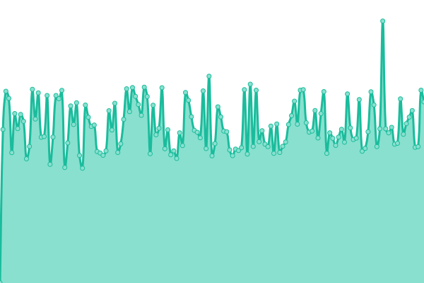

# [📈 Live Status](https://SRESchool.github.io/All-Wizbrand-Websites-Uptime-Monitor): <!--live status--> **🟧 Partial outage**

This repository contains the open-source uptime monitor and status page for [SRESchool](https://SRESchool.github.io/All-Wizbrand-Websites-Uptime-Monitor), powered by [Upptime](https://github.com/upptime/upptime).

With [Upptime](https://upptime.js.org), you can get your own unlimited and free uptime monitor and status page, powered entirely by a GitHub repository. We use [Issues](https://github.com/SRESchool/All-Wizbrand-Websites-Uptime-Monitor/issues) as incident reports, [Actions](https://github.com/SRESchool/All-Wizbrand-Websites-Uptime-Monitor/actions) as uptime monitors, and [Pages](https://SRESchool.github.io/All-Wizbrand-Websites-Uptime-Monitor) for the status page.

<!--start: status pages-->
<!-- This summary is generated by Upptime (https://github.com/upptime/upptime) -->
<!-- Do not edit this manually, your changes will be overwritten -->
<!-- prettier-ignore -->
| URL | Status | History | Response Time | Uptime |
| --- | ------ | ------- | ------------- | ------ |
|  [airegistry.co](https://airegistry.co) | 🟥 Down | [airegistry-co.yml](https://github.com/SRESchool/All-Wizbrand-Websites-Uptime-Monitor/commits/HEAD/history/airegistry-co.yml) | 

 243ms
     
 | 

<a href="https://SRESchool.github.io/All-Wizbrand-Websites-Uptime-Monitor/history/airegistry-co">43.29%</a>
    

|  [guestpostai.com](https://guestpostai.com) | 🟩 Up | [guestpostai-com.yml](https://github.com/SRESchool/All-Wizbrand-Websites-Uptime-Monitor/commits/HEAD/history/guestpostai-com.yml) | 

 668ms
     
 | 

<a href="https://SRESchool.github.io/All-Wizbrand-Websites-Uptime-Monitor/history/guestpostai-com">41.65%</a>
    

|  [wizbrand.com](https://wizbrand.com) | 🟥 Down | [wizbrand-com.yml](https://github.com/SRESchool/All-Wizbrand-Websites-Uptime-Monitor/commits/HEAD/history/wizbrand-com.yml) | 

 0ms
     
 | 

<a href="https://SRESchool.github.io/All-Wizbrand-Websites-Uptime-Monitor/history/wizbrand-com">0.00%</a>
    

|  [gurukulgalaxy.com](https://gurukulgalaxy.com) | 🟩 Up | [gurukulgalaxy-com.yml](https://github.com/SRESchool/All-Wizbrand-Websites-Uptime-Monitor/commits/HEAD/history/gurukulgalaxy-com.yml) | 

 1039ms
     
 | 

<a href="https://SRESchool.github.io/All-Wizbrand-Websites-Uptime-Monitor/history/gurukulgalaxy-com">55.33%</a>
    

|  [cmsgalaxy.com](https://cmsgalaxy.com) | 🟩 Up | [cmsgalaxy-com.yml](https://github.com/SRESchool/All-Wizbrand-Websites-Uptime-Monitor/commits/HEAD/history/cmsgalaxy-com.yml) | 

 1109ms
     
 | 

<a href="https://SRESchool.github.io/All-Wizbrand-Websites-Uptime-Monitor/history/cmsgalaxy-com">32.23%</a>
    

<!--end: status pages-->

[**Visit our status website →**](https://SRESchool.github.io/All-Wizbrand-Websites-Uptime-Monitor)

## 📄 License

- Powered by: [Upptime](https://github.com/upptime/upptime)
- Code: [MIT](./LICENSE) © [Anand Chowdhary](https://anandchowdhary.com), supported by [Pabio](https://pabio.com)
- Data in the `./history` directory: [Open Database License](https://opendatacommons.org/licenses/odbl/1-0/)
